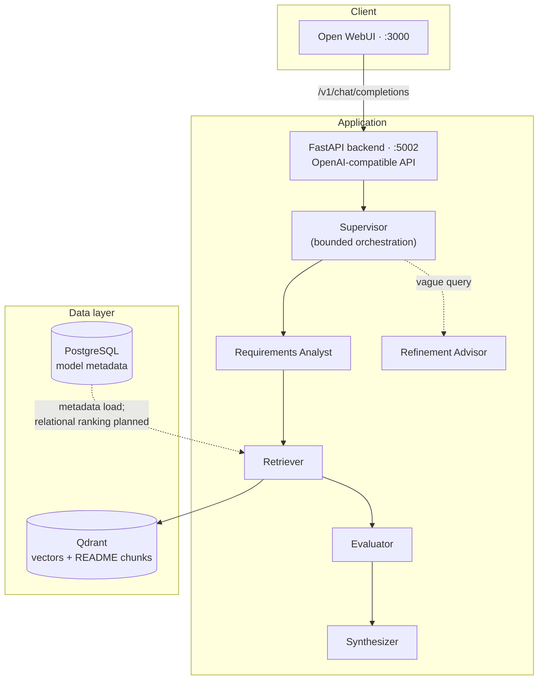

# AgentPick

[](https://opensource.org/licenses/MIT)
[](https://www.python.org/downloads/)
[](https://fastapi.tiangolo.com/)
[](https://qdrant.tech/)
[](https://docs.docker.com/compose/)

**AgentPick recommends Hugging Face language models from natural-language intent.** Describe what you need — task, latency, license, hardware — and a multi-agent pipeline retrieves candidates from a vector index, ranks them with transparent, deterministic scoring, and explains the results in a chat UI.

The design is deliberately **hybrid**: LLMs handle interpretation and conversation, Python handles ranking and logic, and Qdrant handles retrieval. Recommendations are reproducible and explainable rather than hallucinated.

---

## Table of contents

- [What it does](#what-it-does)
- [Architecture](#architecture)
- [Quickstart](#quickstart)
- [Loading model data](#loading-model-data)
- [Ranking model](#ranking-model)
- [API](#api)
- [Configuration](#configuration)
- [Project structure](#project-structure)
- [Local development](#local-development)
- [Troubleshooting](#troubleshooting)
- [Security](#security)
- [Further reading](#further-reading)
- [License](#license)

---

## What it does

Given a user query, AgentPick:

1. **Analyzes** intent and extracts structured constraints (task type, hardware, latency, license, preferences).
2. **Retrieves** candidate models via semantic search in **Qdrant** (the `hf_models` collection).
3. **Scores** candidates with a transparent, deterministic ranking function — no LLM in the evaluator.
4. **Synthesizes** natural-language explanations and supports multi-turn refinement in chat.

When a query is too vague, the pipeline asks targeted follow-up questions instead of guessing.

---

## Architecture



### Components

| Layer | Component | Technology |
|-------|-----------|------------|
| **Frontend** | Chat UI, auth, sessions | [Open WebUI](https://github.com/open-webui/open-webui) (Docker image built from `UI/`) |
| **Backend** | Recommendation API, agent orchestration | FastAPI · [Microsoft Agent Framework](https://github.com/microsoft/agent-framework) (`agent-framework`) |
| **Vectors** | README-chunk embeddings, semantic retrieval | Qdrant · `BAAI/bge-large-en-v1.5` |
| **Metadata** | Per-model stats, tags, Qdrant `chunk_ids` | PostgreSQL 16 |
| **Offline ETL** | Download HF cards, embed, export, load | `agentpick_data/` (Parquet → Qdrant + Postgres) |

The backend exposes an **OpenAI-compatible** HTTP API, so Open WebUI (and any other OpenAI client) can use AgentPick like a custom model provider. Retrieval today runs against **Qdrant**; PostgreSQL holds the structured metadata loaded from the same Parquet pipeline and is wired into Compose for relational filtering and ranking as that path lands in the retriever.

### Agent pipeline

The pipeline runs sequentially with **bounded autonomy** — the supervisor allows at most two refinement loops, so there are no runaway agent cycles.

| Agent | Role | Uses LLM? |
|-------|------|-----------|
| **Supervisor** | Runs each stage, enforces quality gates, bounds refinement (max 2 loops) | No |
| **Requirements Analyst** | Natural language → task type, constraints, preferences (JSON) | Yes |
| **Retriever** | Embed query, search Qdrant, deduplicate chunks by `model_id` | No |
| **Evaluator** | Deterministic weighted scoring and ranking | No |
| **Refinement Advisor** | Asks targeted follow-ups when intent is underspecified | Yes |
| **Synthesizer** | Grounded natural-language recommendations and trade-offs | Yes |

For backend internals (state, agent factory, config), see [`backend/ARCHITECTURE.md`](backend/ARCHITECTURE.md).

---

## Quickstart

**Prerequisites:** Docker and Docker Compose. An [OpenAI API key](https://platform.openai.com/api-keys) is required for the LLM-backed agents (Requirements Analyst, Refinement Advisor, Synthesizer).

```bash
git clone <your-repo-url> agentpick
cd agentpick

export OPENAI_API_KEY="sk-..."                      # required
export WEBUI_SECRET_KEY="$(openssl rand -hex 32)"   # recommended for production

docker compose up -d --build
```

| Service | URL (host) | Role |
|---------|------------|------|
| **UI** (Open WebUI) | http://localhost:3000 | Chat interface |
| **Backend** (FastAPI) | http://localhost:5002 | OpenAI-compatible recommendation API |
| **Qdrant** | http://localhost:6333 | Semantic search over model README chunks |
| **PostgreSQL** | `localhost:5433` | Model metadata (downloads, tags, `chunk_ids`) |

1. Open **http://localhost:3000** and create a local account (the first user becomes admin).
2. Start a chat — the UI is preconfigured to call the backend at `http://backend:5000/v1` inside Docker.
3. Ask for a model, for example: *"I need a small open-source model for summarizing legal documents on CPU."*

> **Important:** `docker compose` starts with **empty databases**. Recommendations only work once you vectorize Hugging Face models and load the stores — see [Loading model data](#loading-model-data).

Stop the stack:

```bash
docker compose down       # keep volumes
docker compose down -v    # remove volumes (Qdrant, Postgres, UI data)
```

---

## Loading model data

The recommendation quality depends entirely on the indexed catalog. The offline pipeline downloads Hugging Face model cards, chunks and embeds them, and loads the result into both stores.

```text
Hugging Face Hub
  → download README + metadata           (agentpick_data/hf_vectorizer)
  → chunk + embed (BAAI/bge-large-en-v1.5)
  → embeddings.parquet
       ├─ load_embeddings_to_qdrant.py   → Qdrant (semantic search)
       └─ initialize_postgres.py         → PostgreSQL (metadata + chunk_ids)
```

With the stack running (Qdrant on `6333`, Postgres on `5433`):

```bash
cd agentpick_data
python -m venv venv && source venv/bin/activate
pip install -r requirements.txt
export PYTHONPATH=src

# 1) Generate embeddings.parquet (long-running; details in agentpick_data/README.md)
bash scripts/run_vectorize.sh

# 2) Load vectors into Qdrant (collection: hf_models)
python src/load_embeddings_to_qdrant.py

# 3) Initialize the Postgres schema and load metadata
#    (Compose maps Postgres to host port 5433)
POSTGRES_PORT=5433 python src/initialize_postgres.py
```

`initialize_postgres.py` waits for Postgres, applies [`init_postgres.sql`](agentpick_data/src/init_postgres.sql), aggregates the Parquet by `model_id`, and upserts one row per model (downloads, likes, tags, `pipeline_tag`, and the list of Qdrant `chunk_ids`). Default credentials match `docker-compose.yaml` (`agentpick` / `agentpick_password`).

Full details, SLURM/HPC submission, and tuning live in [`agentpick_data/README.md`](agentpick_data/README.md).

---

## Ranking model

Ranking is the core contribution and runs **entirely in Python** — deterministic, reproducible, and fully logged. After Qdrant returns candidate chunks (deduplicated to models by averaging chunk similarity), the evaluator computes a weighted composite score:

```text
final_score = w_semantic · similarity
            + w_popularity · popularity
            + w_recency · recency
            + w_hardware · hardware_fit
            + w_license · license_match
            + w_inference · inference_profile
            + w_benchmark · benchmark_score
```

Default weights (sum to `1.0`, validated at startup in [`backend/src/core/config.py`](backend/src/core/config.py)):

| Component | Weight | Signal |
|-----------|:------:|--------|
| `semantic_similarity` | 0.22 | Cosine match between the query and indexed README chunks |
| `popularity` | 0.22 | Downloads and likes (normalized, capped) |
| `license_match` | 0.18 | Compliance with a requested permissive / commercial-friendly license |
| `inference_profile` | 0.18 | CPU / quantization friendliness heuristics (tags, `gguf`/`onnx`, instruct/chat fit) |
| `hardware_fit` | 0.13 | Model-size and hardware-constraint alignment |
| `recency` | 0.04 | Time since last update on the hub |
| `benchmark_score` | 0.03 | Benchmark signals when available |

Weights and thresholds are configurable per request. The supervisor also enforces quality gates: if the top candidate's semantic similarity or composite score is too low, it relaxes filters and re-retrieves (bounded to two iterations) and surfaces clarifying follow-up questions.

---

## API

Base URL on the host: **http://localhost:5002**

| Method | Path | Description |
|--------|------|-------------|
| `POST` | `/v1/chat/completions` | Get recommendations (supports streaming) |
| `GET` | `/v1/models` | List models in OpenAI shape (id: `agentpick-recommender`) |
| `GET` | `/health` | Liveness probe |
| — | `/docs`, `/redoc` | Interactive OpenAPI documentation |

```bash
curl -s http://localhost:5002/health

curl -s http://localhost:5002/v1/chat/completions \
  -H "Content-Type: application/json" \
  -H "Authorization: Bearer dummy" \
  -d '{
    "model": "agentpick-recommender",
    "messages": [{"role": "user", "content": "Fast open model for QA on CPU"}]
  }'
```

Inside the Docker network the UI reaches the backend at `http://backend:5000/v1` (container port `5000`).

---

## Configuration

Environment variables consumed by the backend (defaults set in `docker-compose.yaml`):

| Variable | Used by | Purpose |
|----------|---------|---------|
| `OPENAI_API_KEY` | backend | LLM calls for the analyst, refinement advisor, and synthesizer (**required**) |
| `OPENAI_CHAT_MODEL_ID` | backend | Chat model for agents (default `gpt-5.4-nano`) |
| `OPENAI_BASE_URL` | backend | Optional OpenAI-compatible / Azure-style endpoint |
| `WEBUI_SECRET_KEY` | ui | Session signing key — set a strong value in production |
| `QDRANT_URL` | backend | Qdrant endpoint (`http://qdrant:6333` in Compose) |
| `POSTGRES_*` | backend | Metadata DB connection (`HOST`, `PORT`, `DB`, `USER`, `PASSWORD`) |
| `LOG_LEVEL` | backend | Logging verbosity (default `INFO`) |

Example `.env` in the repository root (read by Compose):

```bash
OPENAI_API_KEY=sk-...
OPENAI_CHAT_MODEL_ID=gpt-5.4-nano
WEBUI_SECRET_KEY=change-me-in-production
```

Useful Docker commands:

```bash
docker compose ps
docker compose logs -f backend
docker compose logs -f ui
docker compose build --no-cache backend ui
```

---

## Project structure

```text
agentpick/
├── docker-compose.yaml        # UI, backend, Qdrant, Postgres
├── README.md
│
├── backend/                   # FastAPI recommendation service
│   ├── Dockerfile
│   ├── app/                   # Routes, schemas, OpenAI adapter
│   ├── src/agents/            # Supervisor, analyst, retriever, evaluator, …
│   ├── src/core/              # State, config, embeddings, agent factory
│   ├── src/evaluation/        # Metrics and benchmarks
│   └── ARCHITECTURE.md        # Backend design reference
│
├── UI/                        # Open WebUI (frontend + its own backend)
│   └── Dockerfile             # Built as the `ui` service
│
├── agentpick_data/            # HF vectorization and DB loaders
│   ├── src/hf_vectorizer/     # Download, parse, chunk, embed
│   ├── src/load_embeddings_to_qdrant.py
│   ├── src/initialize_postgres.py
│   └── src/init_postgres.sql
│
└── docs/                      # Design notes and patterns
```

---

## Local development

### Backend

```bash
cd backend
python -m venv venv && source venv/bin/activate
pip install -r requirements.txt

export OPENAI_API_KEY=sk-...
export QDRANT_URL=http://localhost:6333

uvicorn app.main:app --reload --host 0.0.0.0 --port 5000
```

API: http://localhost:5000 · docs at `/docs`.

### Frontend (Open WebUI)

**Docker (matches production):**

```bash
docker compose up -d ui backend qdrant postgres
```

**Native dev server (hot reload):**

```bash
cd UI
npm install
npm run dev
```

Dev UI: http://localhost:5173 — point the OpenAI settings at `http://localhost:5000/v1` (or `5002` if only the backend container port is mapped).

### Data tooling

```bash
cd agentpick_data
source venv/bin/activate
export PYTHONPATH=src
bash scripts/run_vectorize.sh
python src/load_embeddings_to_qdrant.py
POSTGRES_PORT=5433 python src/initialize_postgres.py
```

---

## Troubleshooting

| Symptom | What to check |
|---------|---------------|
| Empty or poor recommendations | Is the Qdrant collection populated? `curl http://localhost:6333/collections` |
| Backend unhealthy | `docker compose logs backend`; confirm `OPENAI_API_KEY` is set |
| UI cannot reach backend | `docker compose ps`; inside the UI container the backend host is `backend:5000` |
| Postgres connection from host | Use port **5433**, not 5432 |
| Changes not reflected | `docker compose build backend ui && docker compose up -d` |

```bash
curl http://localhost:6333/healthz
docker compose exec backend curl -s http://qdrant:6333/healthz
```

---

## Security

- Set a strong `WEBUI_SECRET_KEY`; never commit secrets to the repository.
- Treat `OPENAI_API_KEY` as sensitive and load it from the environment or a secrets manager.
- Restrict exposed ports and place TLS in front of the UI and API for any public deployment.
- Rotate the default PostgreSQL credentials before going to production.

---

## Further reading

- [Backend architecture](backend/ARCHITECTURE.md)
- [Data vectorization pipeline](agentpick_data/README.md)
- [Project design notes](docs/project.md)

---

## License

MIT — see [`LICENSE`](UI/LICENSE) and the repository license files.
