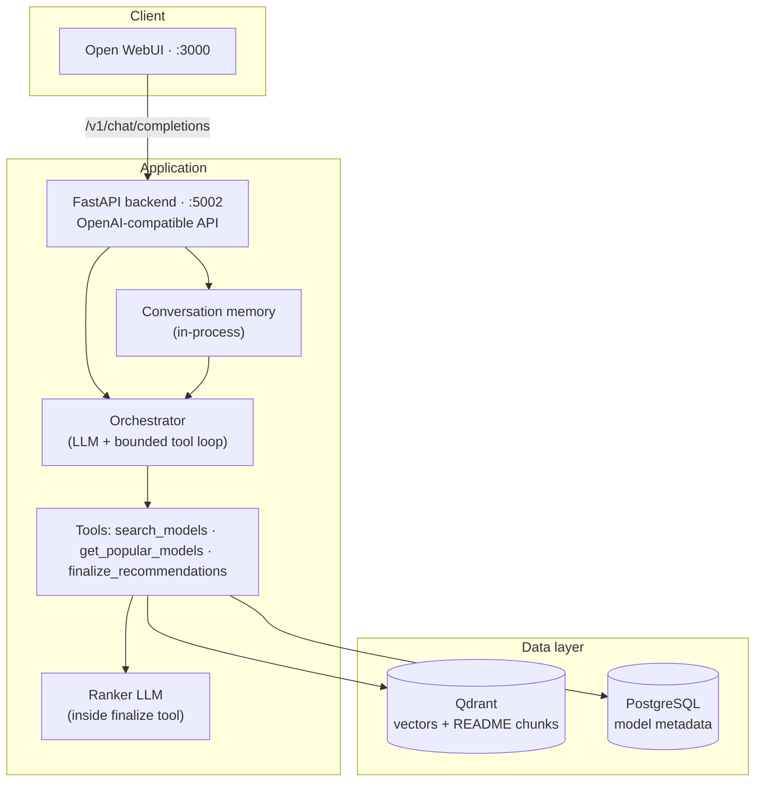

# AgentPick

[](https://opensource.org/licenses/MIT)
[](https://www.python.org/downloads/)
[](https://fastapi.tiangolo.com/)
[](https://qdrant.tech/)
[](https://docs.docker.com/compose/)

**AgentPick recommends Hugging Face language models from natural-language intent.** Describe what you need — task, latency, license, hardware — and a **tool-using orchestrator agent** interprets your request, searches a vector index via tools, ranks candidates with grounded explanations, and presents the results in a chat UI.

The design is **hybrid**: an LLM orchestrator drives a bounded tool loop (search, popularity lookup, finalize); deterministic Python implements each tool (embeddings, Qdrant, PostgreSQL, ranker); ranking stays constrained to model-card metadata supplied in the prompt.

---

## Table of contents

- [What it does](#what-it-does)
- [Architecture](#architecture)
- [Quickstart](#quickstart)
- [Loading model data](#loading-model-data)
- [Ranking](#ranking)
- [API](#api)
- [Configuration](#configuration)
- [Project structure](#project-structure)
- [Local development](#local-development)
- [Troubleshooting](#troubleshooting)
- [Security](#security)
- [Further reading](#further-reading)
- [License](#license)

---

## What it does

Given a user query, AgentPick:

1. **Interprets** intent and multi-turn follow-ups in a bounded orchestrator loop (Microsoft Agent Framework tools + `AgentSession`).
2. **Searches** the catalog via tools — semantic retrieval in **Qdrant**, popularity queries in **PostgreSQL**, optional hybrid popularity filters.
3. **Finalizes** recommendations with the ranker tool: hard-filter → re-rank → grounded explanations.
4. **Returns** up to three recommendations with follow-up questions, or a clarification/redirect when appropriate.

Off-topic messages (greetings, chit-chat) get a plain-text redirect. Underspecified but in-domain requests proceed to search with a best-guess query rather than blocking.

---

## Architecture



### Components

| Layer | Component | Technology |
|-------|-----------|------------|
| **Frontend** | Chat UI, auth, sessions | [Open WebUI](https://github.com/open-webui/open-webui) (Docker image built from `UI/`) |
| **Backend** | Recommendation API, orchestrator | FastAPI · [Microsoft Agent Framework](https://github.com/microsoft/agent-framework) (`agent-framework`) |
| **Vectors** | README-chunk embeddings, semantic retrieval | Qdrant · `BAAI/bge-large-en-v1.5` (1024-dim) |
| **Metadata** | Per-model stats, tags, Qdrant `chunk_ids` | PostgreSQL 16 |
| **Offline ETL** | Download HF cards, embed, export, load | `agentpick_data/` (Parquet → Qdrant + Postgres) |

The backend exposes an **OpenAI-compatible** HTTP API. Retrieval uses **Qdrant** for semantic search; **PostgreSQL** provides structured popularity filtering and authoritative download/like counts in hybrid mode.

### Agent pipeline

The primary path is a **single orchestrator agent** with a **bounded tool loop** (`orchestrator_max_steps`, default 5 LLM roundtrips). The loop exits early when `finalize_recommendations` succeeds or when the model returns clarification text.

| Tool / step | Role | Uses LLM? |
|-------------|------|-----------|
| **Orchestrator** | Interprets intent, follow-ups, off-topic redirects; chooses tools | Yes (`Agent` + `AgentSession`) |
| **`search_models`** | Embed query, search Qdrant, optional hybrid popularity filter | No |
| **`get_popular_models`** | Top models from PostgreSQL by downloads/likes | No |
| **`finalize_recommendations`** | Hard-filter → re-rank → explain top-K | Yes (ranker agent inside tool) |

Shared pipeline state lives in `RecommendationState` (`backend/src/core/state.py`). Recent chat turns from the in-memory store (`backend/src/conversation/`) are included in the orchestrator prompt for multi-turn context. See `docs/agent_patterns.py` for Microsoft Agent Framework tool patterns.

---

## Quickstart

**Prerequisites:** Docker and Docker Compose. An [OpenAI API key](https://platform.openai.com/api-keys) is required for the orchestrator and ranker agents (Microsoft Agent Framework).

```bash
git clone <your-repo-url> agentpick
cd agentpick

export OPENAI_API_KEY="sk-..."                      # required
export WEBUI_SECRET_KEY="$(openssl rand -hex 32)"   # recommended for production

docker compose up -d --build
```

| Service | URL (host) | Role |
|---------|------------|------|
| **UI** (Open WebUI) | http://localhost:3000 | Chat interface |
| **Backend** (FastAPI) | http://localhost:5002 | OpenAI-compatible recommendation API |
| **Qdrant** | http://localhost:6333 | Semantic search over model README chunks |
| **PostgreSQL** | `localhost:5433` | Model metadata (downloads, tags, `chunk_ids`) |

1. Open **http://localhost:3000** and create a local account (the first user becomes admin).
2. Start a chat — the UI is preconfigured to call the backend at `http://backend:5000/v1` inside Docker.
3. Ask for a model, for example: *"I need a small open-source model for summarizing legal documents on CPU."*

> **Important:** `docker compose` starts with **empty databases**. Recommendations only work once you vectorize Hugging Face models and load the stores — see [Loading model data](#loading-model-data).

Stop the stack:

```bash
docker compose down       # keep volumes
docker compose down -v    # remove volumes (Qdrant, Postgres, UI data)
```

---

## Loading model data

The recommendation quality depends entirely on the indexed catalog. The offline pipeline downloads Hugging Face model cards, chunks and embeds them, and loads the result into both stores.

```text
Hugging Face Hub
  → download README + metadata           (agentpick_data/hf_vectorizer)
  → chunk + embed (BAAI/bge-large-en-v1.5)
  → embeddings.parquet
       ├─ load_embeddings_to_qdrant.py   → Qdrant (semantic search)
       └─ initialize_postgres.py         → PostgreSQL (metadata + chunk_ids)
```

With the stack running (Qdrant on `6333`, Postgres on `5433`):

```bash
cd agentpick_data
python -m venv venv && source venv/bin/activate
pip install -r requirements.txt
export PYTHONPATH=src

# 1) Generate embeddings.parquet (long-running; details in agentpick_data/README.md)
bash scripts/run_vectorize.sh

# 2) Load vectors into Qdrant (collection: hf_models)
python src/load_embeddings_to_qdrant.py

# 3) Initialize the Postgres schema and load metadata
#    (Compose maps Postgres to host port 5433)
POSTGRES_PORT=5433 python src/initialize_postgres.py
```

`initialize_postgres.py` waits for Postgres, applies [`init_postgres.sql`](agentpick_data/src/init_postgres.sql), aggregates the Parquet by `model_id`, and upserts one row per model (downloads, likes, tags, `pipeline_tag`, and the list of Qdrant `chunk_ids`). Default credentials match `docker-compose.yaml` (`agentpick` / `agentpick_password`).

Full details, SLURM/HPC submission, and tuning live in [`agentpick_data/README.md`](agentpick_data/README.md).

---

## Ranking

The orchestrator calls **`finalize_recommendations`** when the candidate pool is ready. That tool invokes the **Ranker** agent for a staged, evidence-weighted decision:

1. **Hard filter** — drop candidates that violate explicit constraints (pipeline/task type, modality, language, hardware, license).
2. **Score** — two LLM evaluations per survivor pool, then a deterministic composite:
   - **40% task/domain match** — explicit training or specialization for the requested task (e.g. mathematics, coding, vision).
   - **50% objective evidence** — benchmarks, evaluation results, training details, datasets, architecture, documented capabilities (tool use, function calling). Marketing language is ignored unless backed by facts.
   - **10% community signal** — downloads/likes from PostgreSQL, log-scaled and capped so popularity cannot dominate.
3. **Explain** — return the top 3 with reasons grounded in PostgreSQL `model_card` content, citing objective evidence when available.

If dimension scoring cannot be parsed, the ranker falls back to embedding similarity plus community signal. The ranker is instructed never to invent benchmarks or capabilities not present in the supplied model metadata.

If the orchestrator loop ends without calling finalize but candidates exist, the pipeline **auto-finalizes** once. The orchestrator tool loop is capped by `orchestrator_max_steps` (default 5 LLM roundtrips in `AgentConfig`).

Default pool and output sizes (`RankerConfig` / `RetrieverConfig` in [`backend/src/core/config.py`](backend/src/core/config.py)):

| Parameter | Default | Purpose |
|-----------|:-------:|---------|
| `top_k_chunks` | 90 | Qdrant chunk hits before deduplication |
| `top_k_models` | 30 | Candidate pool after deduplication |
| `candidate_pool_size` | 30 | Models passed to the ranker |
| `top_k` | 3 | Recommendations returned to the user |

---

## API

Base URL on the host: **http://localhost:5002**

| Method | Path | Description |
|--------|------|-------------|
| `POST` | `/v1/chat/completions` | Get recommendations (supports streaming) |
| `GET` | `/v1/models` | List models in OpenAI shape (id: `agentpick-recommender`) |
| `GET` | `/health` | Liveness probe |
| — | `/docs`, `/redoc` | Interactive OpenAPI documentation |

```bash
curl -s http://localhost:5002/health

curl -s http://localhost:5002/v1/chat/completions \
  -H "Content-Type: application/json" \
  -H "Authorization: Bearer dummy" \
  -d '{
    "model": "agentpick-recommender",
    "messages": [{"role": "user", "content": "Fast open model for QA on CPU"}]
  }'
```

Inside the Docker network the UI reaches the backend at `http://backend:5000/v1` (container port `5000`).

---

## Configuration

Environment variables consumed by the backend (defaults set in `docker-compose.yaml`):

| Variable | Used by | Purpose |
|----------|---------|---------|
| `OPENAI_API_KEY` | backend | LLM calls for Orchestrator and Ranker (**required**) |
| `OPENAI_CHAT_MODEL_ID` | backend | Chat model for agents (default `gpt-5.4-nano`) |
| `OPENAI_BASE_URL` | backend | Optional OpenAI-compatible / Azure-style endpoint |
| `WEBUI_SECRET_KEY` | ui | Session signing key — set a strong value in production |
| `QDRANT_URL` | backend | Qdrant endpoint (`http://qdrant:6333` in Compose) |
| `QDRANT_COLLECTION_NAME` | backend | Vector collection (default `hf_models`) |
| `POSTGRES_*` | backend | Metadata DB connection (`HOST`, `PORT`, `DB`, `USER`, `PASSWORD`) |
| `LOG_LEVEL` | backend | Logging verbosity (default `INFO`) |
| `AGENT_ACTIVITY_LOG` | backend | Tool/loop activity log file (default `backend/logs/agentpick.log`) |

Example `.env` in the repository root (read by Compose):

```bash
OPENAI_API_KEY=sk-...
OPENAI_CHAT_MODEL_ID=gpt-5.4-nano
WEBUI_SECRET_KEY=change-me-in-production
```

Useful Docker commands:

```bash
docker compose ps
docker compose logs -f backend
docker compose logs -f ui
docker compose build --no-cache backend ui
```

---

## Project structure

```text
agentpick/
├── docker-compose.yaml        # UI, backend, Qdrant, Postgres
├── README.md
│
├── backend/                   # FastAPI recommendation service
│   ├── Dockerfile
│   ├── app/                   # Routes, schemas, OpenAI adapter
│   ├── src/agents/            # Orchestrator, retriever, ranker
│   ├── src/conversation/      # In-memory session store + history formatting
│   ├── src/core/              # State, config, Agent Framework factory + sessions
│   ├── src/evaluation/        # Metrics and benchmarks
│   └── tests/                 # Unit and integration tests
│
├── UI/                        # Open WebUI (frontend + its own backend)
│   └── Dockerfile             # Built as the `ui` service
│
├── agentpick_data/            # HF vectorization and DB loaders
│   ├── src/hf_vectorizer/     # Download, parse, chunk, embed
│   ├── src/load_embeddings_to_qdrant.py
│   ├── src/initialize_postgres.py
│   └── src/init_postgres.sql
│
└── docs/                      # Design notes and thesis materials
    ├── project.md
    └── architecture.tex
```

---

## Local development

### Backend

```bash
cd backend
python -m venv venv && source venv/bin/activate
pip install -r requirements.txt

export OPENAI_API_KEY=sk-...
export QDRANT_URL=http://localhost:6333

uvicorn app.main:app --reload --host 0.0.0.0 --port 5000
```

API: http://localhost:5000 · docs at `/docs`.

### Frontend (Open WebUI)

**Docker (matches production):**

```bash
docker compose up -d ui backend qdrant postgres
```

**Native dev server (hot reload):**

```bash
cd UI
npm install
npm run dev
```

Dev UI: http://localhost:5173 — point the OpenAI settings at `http://localhost:5000/v1` (or `5002` if only the backend container port is mapped).

### Data tooling

```bash
cd agentpick_data
source venv/bin/activate
export PYTHONPATH=src
bash scripts/run_vectorize.sh
python src/load_embeddings_to_qdrant.py
POSTGRES_PORT=5433 python src/initialize_postgres.py
```

### Tests

```bash
cd backend
pytest tests/
```

---

## Troubleshooting

| Symptom | What to check |
|---------|---------------|
| Empty or poor recommendations | Is the Qdrant collection populated? `curl http://localhost:6333/collections` |
| Backend unhealthy | `docker compose logs backend`; confirm `OPENAI_API_KEY` is set |
| UI cannot reach backend | `docker compose ps`; inside the UI container the backend host is `backend:5000` |
| Postgres connection from host | Use port **5433**, not 5432 |
| Changes not reflected | `docker compose build backend ui && docker compose up -d` |

```bash
curl http://localhost:6333/healthz
docker compose exec backend curl -s http://qdrant:6333/healthz
```

---

## Security

- Set a strong `WEBUI_SECRET_KEY`; never commit secrets to the repository.
- Treat `OPENAI_API_KEY` as sensitive and load it from the environment or a secrets manager.
- Restrict exposed ports and place TLS in front of the UI and API for any public deployment.
- Rotate the default PostgreSQL credentials before going to production.

---

## Further reading

- [Architecture chapter source (LaTeX)](docs/architecture.tex)
- [Data vectorization pipeline](agentpick_data/README.md)
- [Project design notes](docs/project.md)

---

## License

MIT — see [`LICENSE`](UI/LICENSE) and the repository license files.
