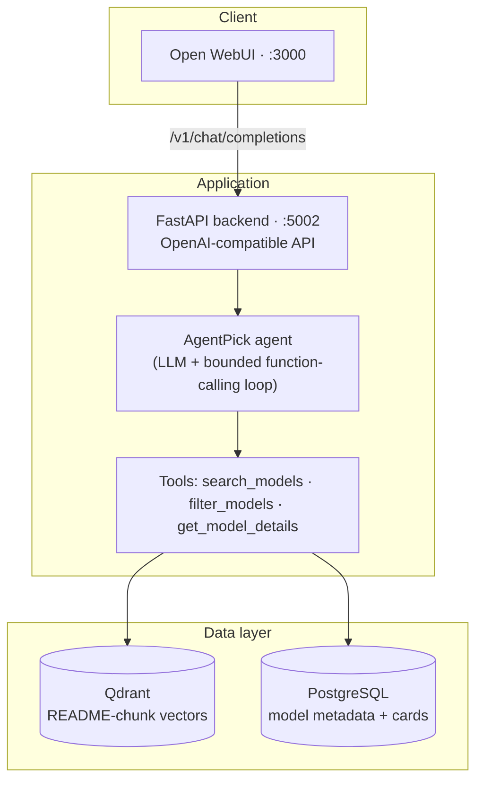

# AgentPick

[](https://opensource.org/licenses/MIT)
[](https://www.python.org/downloads/)
[](https://fastapi.tiangolo.com/)
[](https://qdrant.tech/)
[](https://docs.docker.com/compose/)

**AgentPick recommends Hugging Face language models from natural-language intent.** Describe what you need — task, size limits, hardware, language — and a **tool-using agent** interprets your request, queries a local catalog of model cards through tools, and answers with grounded, ranked recommendations in a chat UI.

The design is **hybrid**: a single LLM agent (Microsoft Agent Framework) drives a bounded function-calling loop; deterministic Python implements each tool (embeddings + Qdrant semantic search, PostgreSQL structured filters, model-card lookup). Every model id in an answer must come verbatim from a tool result — the agent is instructed never to recommend from parametric memory.

---

## Table of contents

- [What it does](#what-it-does)
- [Architecture](#architecture)
- [Quickstart](#quickstart)
- [Loading model data](#loading-model-data)
- [Agent and tools](#agent-and-tools)
- [Evaluation](#evaluation)
- [API](#api)
- [Configuration](#configuration)
- [Project structure](#project-structure)
- [Local development](#local-development)
- [Troubleshooting](#troubleshooting)
- [Security](#security)
- [Further reading](#further-reading)
- [License](#license)

---

## What it does

Given a user query, AgentPick:

1. **Interprets** intent and multi-turn follow-ups (the full chat history is passed on every request — the backend is stateless).
2. **Queries the catalog** through tools, as many times as needed within a bounded loop: semantic search over model-card chunks in **Qdrant**, structured filters and size/popularity rankings in **PostgreSQL**, full model-card lookup for verification.
3. **Answers** with up to three ranked recommendations grounded in tool results, a clarifying question when the request is underspecified, a plain abstention when no catalog model satisfies the constraints, or a redirect when the message is off-topic.

---

## Architecture



### Components

| Layer | Component | Technology |
|-------|-----------|------------|
| **Frontend** | Chat UI, auth, sessions | [Open WebUI](https://github.com/open-webui/open-webui) (Docker image built from `UI/`) |
| **Backend** | Recommendation API, agent | FastAPI · [Microsoft Agent Framework](https://github.com/microsoft/agent-framework) (`agent-framework`) |
| **Vectors** | README-chunk embeddings, semantic retrieval | Qdrant · `BAAI/bge-large-en-v1.5` (1024-dim) |
| **Metadata** | Per-model stats, tags, parameter counts, model cards | PostgreSQL 16 |
| **Offline ETL** | Download HF cards, embed, export, load | `agentpick_data/` (Parquet → Qdrant + Postgres) |

The backend exposes an **OpenAI-compatible** HTTP API, so Open WebUI (or any OpenAI client) can talk to it directly. Conversation context is whatever message history the client sends — there is no server-side session store.

---

## Quickstart

**Prerequisites:** Docker and Docker Compose. An [OpenAI API key](https://platform.openai.com/api-keys) is required for the agent LLM.

```bash
git clone <your-repo-url> agentpick
cd agentpick

# .env in the repo root is read by Docker Compose
cat > .env <<EOF
OPENAI_API_KEY=sk-...
OPENAI_CHAT_MODEL_ID=gpt-5.4-nano
WEBUI_SECRET_KEY=$(openssl rand -hex 32)
EOF

docker compose up -d --build
```

| Service | URL (host) | Role |
|---------|------------|------|
| **UI** (Open WebUI) | http://localhost:3000 | Chat interface |
| **Backend** (FastAPI) | http://localhost:5002 | OpenAI-compatible recommendation API |
| **Qdrant** | http://localhost:6333 | Semantic search over model README chunks |
| **PostgreSQL** | `localhost:5433` | Model metadata (downloads, tags, parameter counts, cards) |

1. Open **http://localhost:3000** and create a local account (the first user becomes admin).
2. Start a chat — the UI is preconfigured to call the backend at `http://backend:5000/v1` inside Docker, with `agentpick-recommender` as the default model.
3. Ask for a model, for example: *"I need a small open-source model for summarizing legal documents on CPU."*

> **Important:** `docker compose` starts with **empty databases**. Recommendations only work once you vectorize Hugging Face models and load the stores — see [Loading model data](#loading-model-data).

Stop the stack:

```bash
docker compose down       # keep volumes
docker compose down -v    # remove volumes (Qdrant, Postgres, UI data)
```

After changing backend code, rebuild the image (the code is baked in, not bind-mounted):

```bash
docker compose build backend && docker compose up -d backend
```

---

## Loading model data

The recommendation quality depends entirely on the indexed catalog. The offline pipeline downloads Hugging Face model cards, chunks and embeds them, and loads the result into both stores.

```text
Hugging Face Hub
  → download README + metadata           (agentpick_data/hf_vectorizer)
  → chunk + embed (BAAI/bge-large-en-v1.5)
  → embeddings.parquet
       ├─ load_embeddings_to_qdrant.py   → Qdrant (semantic search)
       └─ initialize_postgres.py         → PostgreSQL (metadata + chunk_ids)
```

With the stack running (Qdrant on `6333`, Postgres on `5433`):

```bash
cd agentpick_data
python -m venv venv && source venv/bin/activate
pip install -r requirements.txt
export PYTHONPATH=src

# 1) Generate embeddings.parquet (long-running; details in agentpick_data/README.md)
bash scripts/run_vectorize.sh

# 2) Load vectors into Qdrant (collection: hf_models)
python src/load_embeddings_to_qdrant.py

# 3) Initialize the Postgres schema and load metadata
#    (Compose maps Postgres to host port 5433)
POSTGRES_PORT=5433 python src/initialize_postgres.py
```

`initialize_postgres.py` waits for Postgres, applies [`init_postgres.sql`](agentpick_data/src/init_postgres.sql), aggregates the Parquet by `model_id`, and upserts one row per model (downloads, likes, tags, `pipeline_tag`, and the list of Qdrant `chunk_ids`). Default credentials match `docker-compose.yaml` (`agentpick` / `agentpick_password`).

Full details, SLURM/HPC submission, and tuning live in [`agentpick_data/README.md`](agentpick_data/README.md).

---

## Agent and tools

The core is a **single conversational agent** ([`backend/src/agent.py`](backend/src/agent.py)) whose function-calling loop is the agentic part: the LLM decides which tools to call, in what order, and iterates on the results before writing a specialized answer. The loop is capped at `AGENT_MAX_TOOL_ITERATIONS` (default 8) LLM roundtrips per turn.

| Tool | Role | Backed by |
|------|------|-----------|
| **`search_models`** | Semantic search over model-card chunks for fuzzy or task-based intent; re-uploads of one checkpoint are collapsed to a single family entry | Qdrant + Postgres |
| **`filter_models`** | Structured queries for precise constraints and superlatives: `pipeline_tag`, tag, id substring, min/max parameter count, sorting by downloads / likes / smallest / largest / newest; returns `total_matches` and warnings | PostgreSQL |
| **`get_model_details`** | Full metadata and model card (README) for one model, for verification and comparison | PostgreSQL |

Grounding guarantees encoded in the agent instructions and tool data ([`backend/src/catalog.py`](backend/src/catalog.py)):

- Every recommended model id must be copied **verbatim from a tool result** — never from the LLM's memory, even for famous models.
- Tool results **flag quantized/GGUF/AWQ/GPTQ/MLX re-uploads** and exclude randomly-initialized test artifacts, so the agent prefers original checkpoints.
- `filter_models` warns on unconstrained "smallest" sorts (the catalog's small tail is toy models) and reports `total_matches`, so the agent re-queries instead of concluding from one narrow filter.
- Logically impossible constraints (e.g. under 1B **and** over 70B parameters) produce a plain abstention, and models the user names that are not in the catalog are reported as such.

Every request is traced in an activity log (`backend/logs/agentpick.log`): request boundaries, each LLM loop turn with latency, and each tool call with its arguments, result count, and timing.

---

## Evaluation

A reproducible evaluation harness lives in [`evaluation/`](evaluation/README.md): a 20-question gold dataset (verified against the live catalog of 1,709 models) across six categories — deterministic answers, rankings, ambiguous requests, impossible requests, multi-turn dialogues, and off-topic messages. It compares the full **agent** against an **llm_only** baseline (same LLM, no catalog tools) with ranking metrics (precision/recall@3, MRR, nDCG@3), behavioral rates (clarification, abstention, redirect), explanation-quality text metrics (ROUGE-L, BLEU, BERTScore), and bootstrap confidence intervals.

Latest run (2026-07-08, `gpt-5.4-nano`, catalog of 1,709 models):

| Category (n) | Metric | agent | llm_only |
|---|---|---:|---:|
| deterministic (3) | MRR | **1.00** | 0.00 |
| ranking (9) | MRR / nDCG@3 | **0.61 / 0.44** | 0.39 / 0.22 |
| ambiguous (2) | mentions expected model | **0.50** | 0.00 |
| impossible (3) | abstains | **0.67** | 0.33 |
| multi-turn (2) | MRR / nDCG@3 | **0.50 / 0.42** | 0.50 / 0.21 |
| off-topic (1) | redirects | 1.00 | 1.00 |

The agent beats the tool-less baseline in every category with a graded answer; the small n per category and LLM sampling mean individual questions flip between runs, so compare across runs rather than reading single questions as fixed. Full per-question answers and scores are stored in `evaluation/results/`.

Run it yourself (needs the populated data stores and `OPENAI_API_KEY`):

```bash
backend/.venv/bin/python -m evaluation.run                     # both systems
backend/.venv/bin/python -m evaluation.run --systems agent     # agent only
backend/.venv/bin/python -m evaluation.compare evaluation/results/A.json evaluation/results/B.json
```

See [`evaluation/README.md`](evaluation/README.md) for the dataset format, metric definitions, and rescoring.

---

## API

Base URL on the host: **http://localhost:5002**

| Method | Path | Description |
|--------|------|-------------|
| `POST` | `/v1/chat/completions` | Get recommendations (supports streaming) |
| `GET` | `/v1/models` | List models in OpenAI shape (id: `agentpick-recommender`) |
| `GET` | `/health` | Liveness probe |
| — | `/docs`, `/redoc` | Interactive OpenAPI documentation |

```bash
curl -s http://localhost:5002/health

curl -s http://localhost:5002/v1/chat/completions \
  -H "Content-Type: application/json" \
  -H "Authorization: Bearer dummy" \
  -d '{
    "model": "agentpick-recommender",
    "messages": [{"role": "user", "content": "Fast open model for QA on CPU"}]
  }'
```

Inside the Docker network the UI reaches the backend at `http://backend:5000/v1` (container port `5000`). Open WebUI background tasks (title/tag/follow-up generation) are detected and answered with a plain, tool-less completion.

---

## Configuration

Environment variables consumed by the backend (defaults set in `docker-compose.yaml`; a `.env` in the repo root is read by Compose and by the backend itself):

| Variable | Default | Purpose |
|----------|---------|---------|
| `OPENAI_API_KEY` | — | LLM calls for the agent (**required**) |
| `OPENAI_CHAT_MODEL_ID` | `gpt-5.4-nano` | Chat model driving the agent |
| `OPENAI_BASE_URL` | — | Optional OpenAI-compatible endpoint |
| `AGENT_MAX_TOOL_ITERATIONS` | `8` | Cap on LLM roundtrips in the tool loop per turn |
| `QDRANT_URL` | `http://qdrant:6333` in Compose | Qdrant endpoint (or `QDRANT_HOST`/`QDRANT_PORT`) |
| `QDRANT_COLLECTION_NAME` | `hf_models` | Vector collection |
| `QDRANT_TOP_K_CHUNKS` | `120` | Chunk hits pulled before de-duplicating to model families |
| `POSTGRES_*` | see compose file | Metadata DB connection (`HOST`, `PORT`, `DB`, `USER`, `PASSWORD`) |
| `POSTGRES_POOL_SIZE` | `5` | Connection pool size (raise if the agent issues many parallel tool calls) |
| `LOG_LEVEL` | `INFO` | Logging verbosity |
| `AGENT_ACTIVITY_LOG` | `backend/logs/agentpick.log` | Request/tool/loop activity log file |
| `WEBUI_SECRET_KEY` | — | Open WebUI session signing key — set a strong value |

Useful Docker commands:

```bash
docker compose ps
docker compose logs -f backend
docker compose logs -f ui
docker compose build backend && docker compose up -d backend
```

---

## Project structure

```text
agentpick/
├── docker-compose.yaml        # UI, backend, Qdrant, Postgres
├── README.md
│
├── backend/                   # FastAPI recommendation service
│   ├── Dockerfile
│   ├── run.py                 # Local entry point (uvicorn)
│   ├── app/                   # HTTP layer
│   │   ├── main.py            # App factory, warmup, logging
│   │   ├── routes/            # /v1/chat/completions, /v1/models, /health
│   │   ├── schemas/           # OpenAI request models
│   │   └── services/          # OpenAI wire-format helpers (SSE, messages)
│   └── src/                   # Agent core
│       ├── agent.py           # Agent definition, instructions, request runners
│       ├── tools.py           # search_models · filter_models · get_model_details
│       ├── catalog.py         # Qdrant + PostgreSQL access, result shaping
│       └── core/              # Config, embedder, activity log
│
├── evaluation/                # Gold-standard eval harness (see its README)
│   ├── dataset.json           # 20 verified questions in 6 categories
│   ├── run.py · metrics.py · systems.py · compare.py
│   ├── results/               # Timestamped per-question results + summaries
│   └── tests/                 # Unit tests for the metrics
│
├── UI/                        # Open WebUI (frontend + its own backend)
│   └── Dockerfile             # Built as the `ui` service
│
├── agentpick_data/            # Offline ETL: HF vectorization and DB loaders
│   ├── src/hf_vectorizer/     # Download, parse, chunk, embed
│   ├── src/load_embeddings_to_qdrant.py
│   ├── src/initialize_postgres.py
│   └── src/init_postgres.sql
│
└── docs/                      # Design notes and framework pattern references
```

---

## Local development

### Backend

```bash
cd backend
python -m venv .venv && source .venv/bin/activate
pip install -r requirements.txt

export OPENAI_API_KEY=sk-...
export QDRANT_URL=http://localhost:6333
export POSTGRES_PORT=5433        # Compose maps Postgres to host port 5433

uvicorn app.main:app --reload --host 0.0.0.0 --port 5000
```

API: http://localhost:5000 · docs at `/docs`. The data stores can keep running in Docker (`docker compose up -d qdrant postgres`).

### Frontend (Open WebUI)

**Docker (matches production):**

```bash
docker compose up -d ui backend qdrant postgres
```

**Native dev server (hot reload):**

```bash
cd UI
npm install
npm run dev
```

Dev UI: http://localhost:5173 — point the OpenAI settings at `http://localhost:5000/v1` (or `5002` if only the backend container port is mapped).

### Tests

Unit tests cover the evaluation metrics:

```bash
backend/.venv/bin/python -m pytest evaluation/tests    # from the repository root
```

---

## Troubleshooting

| Symptom | What to check |
|---------|---------------|
| Empty or poor recommendations | Is the Qdrant collection populated? `curl http://localhost:6333/collections` |
| Backend unhealthy | `docker compose logs backend`; confirm `OPENAI_API_KEY` is set |
| UI cannot reach backend | `docker compose ps`; inside the UI container the backend host is `backend:5000` |
| Postgres connection from host | Use port **5433**, not 5432 |
| `connection pool exhausted` in the activity log | The agent fired more parallel tool calls than the pool allows — raise `POSTGRES_POOL_SIZE` |
| Changes not reflected | `docker compose build backend ui && docker compose up -d` (backend code is baked into the image) |

```bash
curl http://localhost:6333/healthz
docker compose exec backend curl -s http://qdrant:6333/healthz
```

---

## Security

- Set a strong `WEBUI_SECRET_KEY`; never commit secrets to the repository.
- Treat `OPENAI_API_KEY` as sensitive and load it from the environment or a secrets manager.
- Restrict exposed ports and place TLS in front of the UI and API for any public deployment.
- Rotate the default PostgreSQL credentials before going to production.

---

## Further reading

- [Evaluation harness and metrics](evaluation/README.md)
- [Data vectorization pipeline](agentpick_data/README.md)
- [Project proposal](docs/project_proposal.md)

---

## License

MIT — see [`LICENSE`](UI/LICENSE) and the repository license files.
